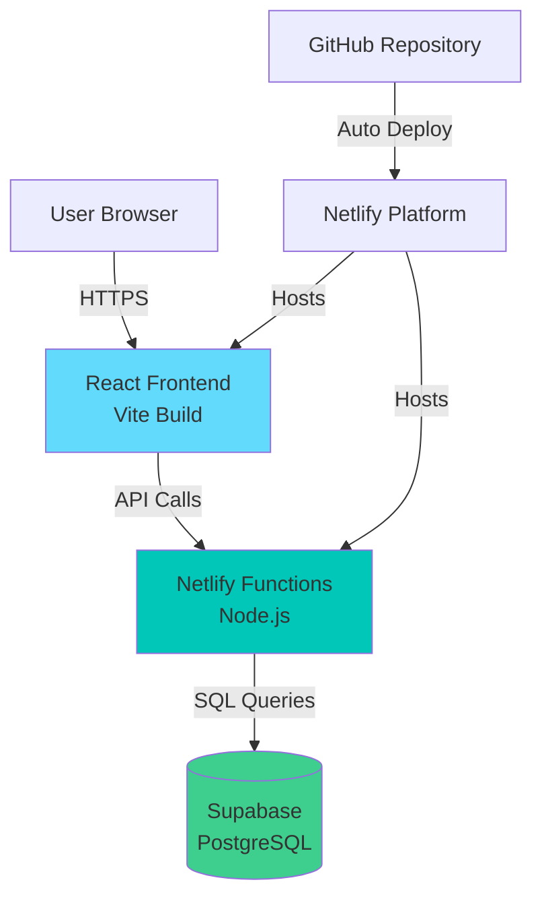
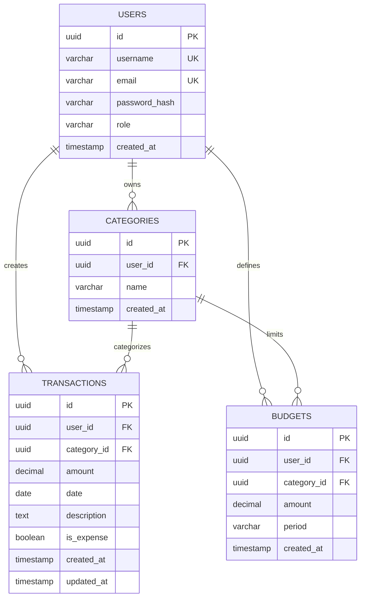

# Design Document

## Overview

The Personal Finance MVP is a full-stack web application that enables users to track transactions, manage budgets, and visualize spending patterns. The system uses a modern serverless architecture with React frontend, Netlify Functions backend, and Supabase PostgreSQL database.

### Technology Stack

- **Frontend**: React 18 with Vite, TailwindCSS, Chart.js (react-chartjs-2), Axios
- **Backend**: Netlify Functions (Node.js serverless)
- **Database**: Supabase (PostgreSQL)
- **Authentication**: JWT with bcrypt password hashing
- **Deployment**: Netlify (frontend + functions)
- **CI/CD**: GitHub Actions
- **Version Control**: Public GitHub repository

### Key Design Decisions

1. **Serverless Architecture**: Using Netlify Functions eliminates server management overhead and provides automatic scaling
2. **JWT Authentication**: Stateless authentication with short-lived access tokens (15min) and refresh tokens for security
3. **Supabase**: Managed PostgreSQL provides robust relational data model with built-in connection pooling
4. **Monorepo Structure**: Single repository with separate frontend and backend directories for simplified deployment
5. **Client-Side Token Storage**: Access tokens in localStorage for simplicity; refresh tokens handled securely

## Architecture

### System Architecture Diagram



### Request Flow

1. User interacts with React frontend
2. Frontend makes authenticated API calls to Netlify Functions
3. Functions validate JWT tokens
4. Functions query/update Supabase database
5. Response flows back through the chain

### Directory Structure

```
kiro-personal-finance/
├── frontend/
│   ├── src/
│   │   ├── components/
│   │   │   ├── auth/
│   │   │   │   ├── LoginForm.jsx
│   │   │   │   └── RegisterForm.jsx
│   │   │   ├── dashboard/
│   │   │   │   ├── AccountSummary.jsx
│   │   │   │   ├── RecentTransactions.jsx
│   │   │   │   └── QuickAddModal.jsx
│   │   │   ├── transactions/
│   │   │   │   ├── TransactionList.jsx
│   │   │   │   ├── TransactionFilters.jsx
│   │   │   │   └── TransactionForm.jsx
│   │   │   ├── budgets/
│   │   │   │   ├── BudgetList.jsx
│   │   │   │   ├── BudgetForm.jsx
│   │   │   │   └── BudgetUtilization.jsx
│   │   │   ├── reports/
│   │   │   │   ├── SpendingByCategory.jsx
│   │   │   │   └── SpendingOverTime.jsx
│   │   │   └── common/
│   │   │       ├── Navbar.jsx
│   │   │       ├── Pagination.jsx
│   │   │       └── ProtectedRoute.jsx
│   │   ├── pages/
│   │   │   ├── Login.jsx
│   │   │   ├── Register.jsx
│   │   │   ├── Dashboard.jsx
│   │   │   ├── Transactions.jsx
│   │   │   ├── Budgets.jsx
│   │   │   └── Reports.jsx
│   │   ├── services/
│   │   │   ├── api.js
│   │   │   ├── auth.js
│   │   │   └── storage.js
│   │   ├── hooks/
│   │   │   ├── useAuth.js
│   │   │   └── useApi.js
│   │   ├── App.jsx
│   │   └── main.jsx
│   ├── public/
│   ├── index.html
│   ├── vite.config.js
│   ├── tailwind.config.js
│   ├── package.json
│   └── .env.example
├── netlify/
│   └── functions/
│       ├── api-register.js
│       ├── api-login.js
│       ├── api-refresh.js
│       ├── api-profile.js
│       ├── api-transactions.js
│       ├── api-transactions-id.js
│       ├── api-budgets.js
│       ├── api-reports-spending.js
│       ├── api-import-csv.js
│       └── utils/
│           ├── auth.js
│           ├── db.js
│           └── validation.js
├── sql/
│   ├── migrations.sql
│   └── seed.sql
├── .github/
│   └── workflows/
│       └── ci.yml
├── .env.example
├── .gitignore
├── netlify.toml
├── package.json
└── README.md
```

## Components and Interfaces

### Backend API Endpoints

#### Authentication Endpoints

**POST /api/register**
```javascript
Request:
{
  "username": "string",
  "email": "string",
  "password": "string",
  "role": "user" | "hardcoder"
}

Response: 201
{
  "id": "uuid",
  "username": "string",
  "email": "string",
  "role": "string",
  "created_at": "timestamp"
}
```

**POST /api/login**
```javascript
Request:
{
  "username": "string",
  "password": "string"
}

Response: 200
{
  "accessToken": "jwt_string",
  "refreshToken": "jwt_string",
  "user": {
    "id": "uuid",
    "username": "string",
    "role": "string"
  }
}
```

**POST /api/token/refresh**
```javascript
Request:
{
  "refreshToken": "jwt_string"
}

Response: 200
{
  "accessToken": "jwt_string"
}
```

**GET /api/profile**
```javascript
Headers: Authorization: Bearer <accessToken>

Response: 200
{
  "id": "uuid",
  "username": "string",
  "email": "string",
  "role": "string",
  "created_at": "timestamp"
}
```

#### Transaction Endpoints

**GET /api/transactions?start=YYYY-MM-DD&end=YYYY-MM-DD**
```javascript
Headers: Authorization: Bearer <accessToken>

Response: 200
{
  "transactions": [
    {
      "id": "uuid",
      "amount": "decimal",
      "date": "YYYY-MM-DD",
      "category_id": "uuid",
      "category_name": "string",
      "description": "string",
      "is_expense": "boolean"
    }
  ],
  "total": "integer"
}
```

**POST /api/transactions**
```javascript
Headers: Authorization: Bearer <accessToken>
Request:
{
  "amount": "decimal",
  "date": "YYYY-MM-DD",
  "category_id": "uuid",
  "description": "string",
  "is_expense": "boolean"
}

Response: 201
{
  "id": "uuid",
  "user_id": "uuid",
  "amount": "decimal",
  "date": "YYYY-MM-DD",
  "category_id": "uuid",
  "description": "string",
  "is_expense": "boolean"
}
```

**PUT /api/transactions/:id**
```javascript
Headers: Authorization: Bearer <accessToken>
Request:
{
  "amount": "decimal",
  "date": "YYYY-MM-DD",
  "category_id": "uuid",
  "description": "string",
  "is_expense": "boolean"
}

Response: 200
{
  "id": "uuid",
  "amount": "decimal",
  "date": "YYYY-MM-DD",
  "category_id": "uuid",
  "description": "string",
  "is_expense": "boolean"
}
```

**DELETE /api/transactions/:id**
```javascript
Headers: Authorization: Bearer <accessToken>

Response: 204
```

#### Budget Endpoints

**GET /api/budgets**
```javascript
Headers: Authorization: Bearer <accessToken>

Response: 200
{
  "budgets": [
    {
      "id": "uuid",
      "category_id": "uuid",
      "category_name": "string",
      "amount": "decimal",
      "period": "string",
      "spent": "decimal"
    }
  ]
}
```

**POST /api/budgets**
```javascript
Headers: Authorization: Bearer <accessToken>
Request:
{
  "category_id": "uuid",
  "amount": "decimal",
  "period": "monthly" | "weekly" | "yearly"
}

Response: 201
{
  "id": "uuid",
  "user_id": "uuid",
  "category_id": "uuid",
  "amount": "decimal",
  "period": "string"
}
```

#### Reports Endpoints

**GET /api/reports/spending-by-category?start=YYYY-MM-DD&end=YYYY-MM-DD**
```javascript
Headers: Authorization: Bearer <accessToken>

Response: 200
{
  "data": [
    {
      "category_name": "string",
      "total": "decimal"
    }
  ]
}
```

#### Import Endpoint

**POST /api/import-csv**
```javascript
Headers: 
  Authorization: Bearer <accessToken>
  Content-Type: multipart/form-data

Request: FormData with 'file' field

Response: 200
{
  "imported": "integer",
  "errors": [
    {
      "row": "integer",
      "message": "string"
    }
  ]
}
```

### Frontend Components

#### Authentication Components

**LoginForm.jsx**
- Handles username/password input
- Calls auth service login method
- Stores tokens in localStorage
- Redirects to dashboard on success

**RegisterForm.jsx**
- Handles registration form with username, email, password, role
- Validates input fields
- Calls auth service register method
- Redirects to login on success

#### Dashboard Components

**AccountSummary.jsx**
- Displays total balance (income - expenses)
- Shows monthly income total
- Shows monthly expense total
- Fetches data from transactions API

**RecentTransactions.jsx**
- Lists last 10 transactions
- Shows amount, date, category, description
- Links to full transactions page

**QuickAddModal.jsx**
- Modal form for adding transactions
- Fields: amount, date, category, description, type (income/expense)
- Submits to transactions API

#### Transaction Components

**TransactionList.jsx**
- Paginated table of transactions
- Columns: date, description, category, amount, actions
- Edit/delete buttons for each row
- Calls transactions API

**TransactionFilters.jsx**
- Date range picker (start/end)
- Category dropdown filter
- Apply/reset buttons
- Updates parent component state

**TransactionForm.jsx**
- Form for creating/editing transactions
- Validation for required fields
- Submits to transactions API

#### Budget Components

**BudgetList.jsx**
- Lists all user budgets
- Shows category, amount, period
- Displays utilization bar for each budget
- Delete button for each budget

**BudgetForm.jsx**
- Form for creating budgets
- Fields: category, amount, period
- Submits to budgets API

**BudgetUtilization.jsx**
- Progress bar showing spent/budget ratio
- Color coding: green (<70%), yellow (70-90%), red (>90%)
- Displays percentage and amounts

#### Report Components

**SpendingByCategory.jsx**
- Pie chart using Chart.js
- Fetches data from reports API
- Date range filter
- Legend with category names and amounts

**SpendingOverTime.jsx**
- Bar or line chart using Chart.js
- Groups transactions by day/week/month
- Date range filter
- Shows spending trends

### Authentication Middleware

**auth.js (Backend)**
```javascript
// Middleware function
async function verifyToken(event) {
  const authHeader = event.headers.authorization;
  if (!authHeader || !authHeader.startsWith('Bearer ')) {
    throw new Error('No token provided');
  }
  
  const token = authHeader.substring(7);
  const decoded = jwt.verify(token, process.env.JWT_SECRET);
  
  return decoded; // Contains userId, role
}
```

**useAuth.js (Frontend Hook)**
```javascript
export function useAuth() {
  const [user, setUser] = useState(null);
  const [loading, setLoading] = useState(true);
  
  useEffect(() => {
    const token = localStorage.getItem('accessToken');
    if (token) {
      // Verify token and fetch user profile
      fetchProfile(token).then(setUser);
    }
    setLoading(false);
  }, []);
  
  const login = async (username, password) => {
    const response = await api.post('/api/login', { username, password });
    localStorage.setItem('accessToken', response.data.accessToken);
    localStorage.setItem('refreshToken', response.data.refreshToken);
    setUser(response.data.user);
  };
  
  const logout = () => {
    localStorage.removeItem('accessToken');
    localStorage.removeItem('refreshToken');
    setUser(null);
  };
  
  return { user, loading, login, logout };
}
```

## Data Models

### Database Schema

```sql
-- Users table
CREATE TABLE users (
  id UUID PRIMARY KEY DEFAULT gen_random_uuid(),
  username VARCHAR(50) UNIQUE NOT NULL,
  email VARCHAR(255) UNIQUE NOT NULL,
  password_hash VARCHAR(255) NOT NULL,
  role VARCHAR(20) NOT NULL CHECK (role IN ('user', 'hardcoder')),
  created_at TIMESTAMP DEFAULT CURRENT_TIMESTAMP
);

-- Categories table
CREATE TABLE categories (
  id UUID PRIMARY KEY DEFAULT gen_random_uuid(),
  user_id UUID NOT NULL REFERENCES users(id) ON DELETE CASCADE,
  name VARCHAR(100) NOT NULL,
  created_at TIMESTAMP DEFAULT CURRENT_TIMESTAMP,
  UNIQUE(user_id, name)
);

-- Transactions table
CREATE TABLE transactions (
  id UUID PRIMARY KEY DEFAULT gen_random_uuid(),
  user_id UUID NOT NULL REFERENCES users(id) ON DELETE CASCADE,
  category_id UUID NOT NULL REFERENCES categories(id) ON DELETE RESTRICT,
  amount DECIMAL(12, 2) NOT NULL,
  date DATE NOT NULL,
  description TEXT,
  is_expense BOOLEAN NOT NULL DEFAULT true,
  created_at TIMESTAMP DEFAULT CURRENT_TIMESTAMP,
  updated_at TIMESTAMP DEFAULT CURRENT_TIMESTAMP
);

-- Budgets table
CREATE TABLE budgets (
  id UUID PRIMARY KEY DEFAULT gen_random_uuid(),
  user_id UUID NOT NULL REFERENCES users(id) ON DELETE CASCADE,
  category_id UUID NOT NULL REFERENCES categories(id) ON DELETE CASCADE,
  amount DECIMAL(12, 2) NOT NULL CHECK (amount > 0),
  period VARCHAR(20) NOT NULL CHECK (period IN ('weekly', 'monthly', 'yearly')),
  created_at TIMESTAMP DEFAULT CURRENT_TIMESTAMP,
  UNIQUE(user_id, category_id, period)
);

-- Indexes for performance
CREATE INDEX idx_transactions_user_date ON transactions(user_id, date DESC);
CREATE INDEX idx_transactions_category ON transactions(category_id);
CREATE INDEX idx_budgets_user ON budgets(user_id);
CREATE INDEX idx_categories_user ON categories(user_id);
```

### Entity Relationships



## Error Handling

### Backend Error Responses

All API errors follow consistent format:

```javascript
{
  "error": {
    "message": "Human-readable error message",
    "code": "ERROR_CODE",
    "details": {} // Optional additional context
  }
}
```

### HTTP Status Codes

- **200 OK**: Successful GET/PUT request
- **201 Created**: Successful POST request
- **204 No Content**: Successful DELETE request
- **400 Bad Request**: Invalid input data
- **401 Unauthorized**: Missing or invalid authentication
- **403 Forbidden**: Insufficient permissions
- **404 Not Found**: Resource doesn't exist
- **409 Conflict**: Duplicate resource (e.g., username exists)
- **500 Internal Server Error**: Server-side error

### Error Handling Strategy

**Backend (Netlify Functions)**
```javascript
exports.handler = async (event) => {
  try {
    // Function logic
    return {
      statusCode: 200,
      body: JSON.stringify(data)
    };
  } catch (error) {
    console.error('Error:', error);
    
    if (error.name === 'JsonWebTokenError') {
      return {
        statusCode: 401,
        body: JSON.stringify({
          error: { message: 'Invalid token', code: 'INVALID_TOKEN' }
        })
      };
    }
    
    if (error.code === '23505') { // Postgres unique violation
      return {
        statusCode: 409,
        body: JSON.stringify({
          error: { message: 'Resource already exists', code: 'DUPLICATE' }
        })
      };
    }
    
    return {
      statusCode: 500,
      body: JSON.stringify({
        error: { message: 'Internal server error', code: 'SERVER_ERROR' }
      })
    };
  }
};
```

**Frontend (Axios Interceptor)**
```javascript
api.interceptors.response.use(
  response => response,
  async error => {
    if (error.response?.status === 401) {
      // Try to refresh token
      const refreshToken = localStorage.getItem('refreshToken');
      if (refreshToken) {
        try {
          const response = await axios.post('/api/token/refresh', { refreshToken });
          localStorage.setItem('accessToken', response.data.accessToken);
          // Retry original request
          return api.request(error.config);
        } catch (refreshError) {
          // Refresh failed, logout user
          localStorage.clear();
          window.location.href = '/login';
        }
      }
    }
    return Promise.reject(error);
  }
);
```

### Input Validation

**Backend Validation Utility**
```javascript
function validateTransaction(data) {
  const errors = [];
  
  if (!data.amount || isNaN(data.amount)) {
    errors.push('Amount must be a valid number');
  }
  
  if (!data.date || !/^\d{4}-\d{2}-\d{2}$/.test(data.date)) {
    errors.push('Date must be in YYYY-MM-DD format');
  }
  
  if (!data.category_id) {
    errors.push('Category ID is required');
  }
  
  if (typeof data.is_expense !== 'boolean') {
    errors.push('is_expense must be a boolean');
  }
  
  return errors;
}
```

## Testing Strategy

### Backend Testing

**Unit Tests (Jest)**
- Test authentication functions (password hashing, JWT generation)
- Test validation utilities
- Test database query builders
- Mock Supabase client for isolated tests

**Integration Tests**
- Test API endpoints with test database
- Verify authentication middleware
- Test CORS configuration
- Verify error handling

**Test Structure**
```javascript
// __tests__/auth.test.js
describe('Authentication', () => {
  test('should hash password correctly', async () => {
    const password = 'testpass123';
    const hash = await hashPassword(password);
    expect(hash).not.toBe(password);
    expect(await comparePassword(password, hash)).toBe(true);
  });
  
  test('should generate valid JWT', () => {
    const token = generateToken({ userId: '123', role: 'user' });
    const decoded = jwt.verify(token, process.env.JWT_SECRET);
    expect(decoded.userId).toBe('123');
  });
});
```

### Frontend Testing

**Component Tests (Vitest + React Testing Library)**
- Test form submissions
- Test authentication flows
- Test data fetching and display
- Test error states

**E2E Tests (Optional - Playwright)**
- Test complete user flows
- Test authentication
- Test transaction CRUD
- Test report generation

### CI/CD Testing

**GitHub Actions Workflow**
```yaml
name: CI

on: [push, pull_request]

jobs:
  test:
    runs-on: ubuntu-latest
    steps:
      - uses: actions/checkout@v3
      - uses: actions/setup-node@v3
        with:
          node-version: '18'
      
      # Frontend
      - name: Install frontend dependencies
        run: cd frontend && npm ci
      - name: Lint frontend
        run: cd frontend && npm run lint
      - name: Build frontend
        run: cd frontend && npm run build
      
      # Backend
      - name: Install backend dependencies
        run: cd netlify/functions && npm ci
      - name: Test backend
        run: cd netlify/functions && npm test
```

## Security Considerations

### Password Security
- Use bcrypt with 10+ salt rounds
- Never log or expose password hashes
- Enforce minimum password length (8 characters)

### JWT Security
- Short-lived access tokens (15 minutes)
- Secure JWT_SECRET (minimum 32 characters)
- Include user ID and role in token payload
- Verify tokens on every protected endpoint

### CORS Configuration
```javascript
const headers = {
  'Access-Control-Allow-Origin': process.env.NODE_ENV === 'production' 
    ? 'https://your-app.netlify.app' 
    : 'http://localhost:5173',
  'Access-Control-Allow-Headers': 'Content-Type, Authorization',
  'Access-Control-Allow-Methods': 'GET, POST, PUT, DELETE, OPTIONS'
};
```

### Input Sanitization
- Validate all inputs before processing
- Use parameterized queries to prevent SQL injection
- Sanitize CSV uploads
- Limit file upload sizes

### Authorization
- Verify user ownership before modifying resources
- Check user role for admin operations
- Return 403 for unauthorized access attempts

## Deployment Configuration

### Netlify Configuration (netlify.toml)

```toml
[build]
  command = "cd frontend && npm ci && npm run build"
  publish = "frontend/dist"
  functions = "netlify/functions"

[build.environment]
  NODE_VERSION = "18"

[[redirects]]
  from = "/api/*"
  to = "/.netlify/functions/:splat"
  status = 200

[[redirects]]
  from = "/*"
  to = "/index.html"
  status = 200
```

### Environment Variables

**Netlify Dashboard Configuration**
- `SUPABASE_URL`: Supabase project URL
- `SUPABASE_SERVICE_ROLE_KEY`: Supabase service role key (server-side only)
- `JWT_SECRET`: Secret for signing JWT tokens
- `NODE_ENV`: production
- `VITE_API_BASE_URL`: Base URL for API calls (e.g., https://your-app.netlify.app)

**Local Development (.env)**
```
SUPABASE_URL=https://xxxxx.supabase.co
SUPABASE_SERVICE_ROLE_KEY=your_service_role_key
JWT_SECRET=your_jwt_secret_min_32_chars
NODE_ENV=development
VITE_API_BASE_URL=http://localhost:8888
```

### Supabase Setup

1. Create new Supabase project
2. Run migrations from `sql/migrations.sql`
3. Run seed data from `sql/seed.sql`
4. Copy project URL and service role key
5. Configure connection pooling if needed

### GitHub Repository Setup

1. Create public repository
2. Add secrets for CI/CD (if needed)
3. Enable GitHub Actions
4. Connect to Netlify for auto-deployment

## Performance Optimization

### Frontend Optimization
- Code splitting with React.lazy()
- Memoize expensive computations with useMemo
- Debounce search/filter inputs
- Lazy load charts only when reports page is accessed
- Optimize images and assets

### Backend Optimization
- Use database indexes on frequently queried columns
- Implement pagination for large result sets
- Cache frequently accessed data (optional)
- Use connection pooling in Supabase

### Database Optimization
- Index on user_id, date, category_id
- Use EXPLAIN ANALYZE for slow queries
- Limit result sets with LIMIT/OFFSET
- Use aggregate queries for reports

## Monitoring and Logging

### Netlify Function Logs
- Access via Netlify dashboard
- Log errors with context
- Monitor function execution time
- Track cold start performance

### Error Tracking
- Console.error for backend errors
- Include request context in logs
- Monitor 4xx and 5xx responses

### Performance Metrics
- Track API response times
- Monitor database query performance
- Track frontend bundle size
- Monitor Lighthouse scores
